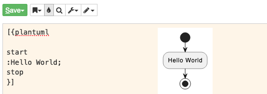

# PlantUML Plugin for JSPWiki
for [JSPWiki](https://jspwiki.apache.org/) v2.10.1+  
[PlantUml](https://plantuml.com/) v1.2023.1

## Usage



Also you can use link attribute to link PNG source under the SVG.  
```
[{plantuml link="Download"

start
:Hello World;
stop
}]
```

## Installation

1. download the jar into `${JSPWIKI_HOME}/WEB-INF/lib/`
```shell
wget "https://github.com/pmamico/jspwiki-plantuml/blob/master/bin/PlantUmlPlugin-1.1.jar?raw=true" -O plantuml-plugin.jar
```
2. edit the comma-delimited ``jspwiki.plugin.searchPath`` in `${JSPWIKI_HOME}/WEB-INF/jspwiki-custom.properties` to include the package designation of the plugin
```properties
jspwiki.plugin.searchPath = hu.pmamico.jspwiki.plugin
```
3. restart JSPWiki (or restart Tomcat)


## Build
```shell
mvn clean compile assembly:single antrun:run
```
